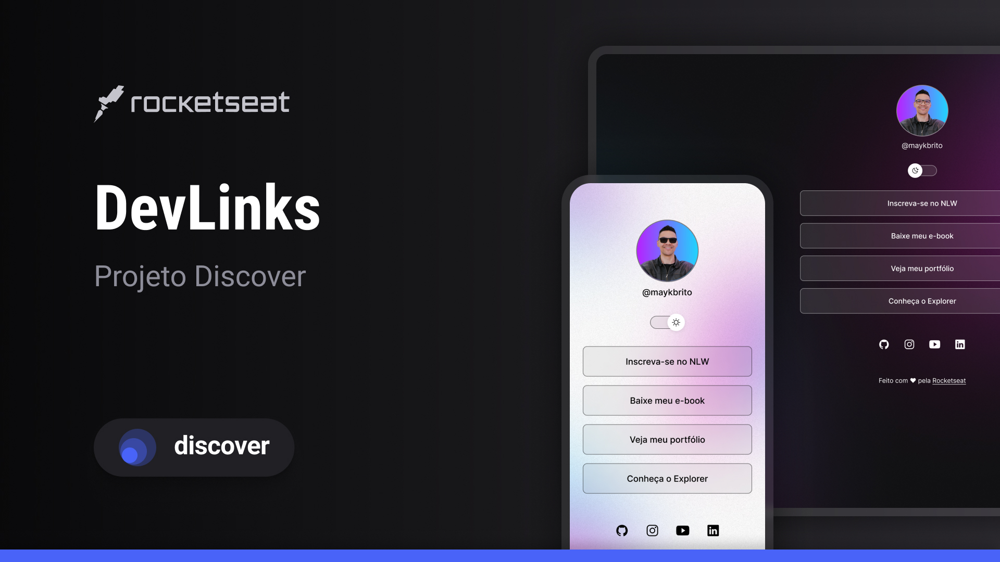

<h1 align="center">DevLinks</h1>
<h3 align="center">Um programa exclusivo e gratuito, promovido pela Rocketseat para ensino de tecnologias WEB.</h3>

    <a href="#tecnologias">Tecnologias</a>&nbsp;|
    <a href="#projeto">Projeto</a>&nbsp;|
    <a href="layout">Layout</a>&nbsp;|
    <a href="Licenca">Licença</a>

<h2 id="tecnologias">👾 Tecnologias</h2>

Este projeto utilizou as seguintes tecnologias:

<ul>
    <li>HTML e CSS</li>
    <li>JavaScript</li>
    <li>Git e Github</li>
    <li>Figma</li>
</ul>

<h2 id="projeto">⛳️ Projeto</h2>

O <strong>DevLinks</strong> é um agregador de links para usar como cartão de visitas online.

<h2 id="layout">💻 Layout</h2>

Você pode visualizar o layout do projeto através <a href="https://www.figma.com/design/BRsMno0JREGpZhC4MAClRY/DevLinks-%E2%80%A2-Projeto-Discover-(Community)?node-id=10-620&t=egveioZGWSVJJ1oL-0" style="text-decoration:underline;color:white;">desse link</a>. É necessário uma conta no <a href="https://figma.com" style="text-decoration:underline;color:white;">Figma</a> para acessá-lo

<h2 id="licenca">📜 Licença</h2>

Este projeto está sob a licença MIT.

  

Feito com ❤️ pela Rocketseat

Participe da nossa <a href="https://discord.gg/rocketseat" style="text-decoration:underline;color:white;">comunidade</a>

